# Vercel Deployment Flow

```mermaid
graph TD
    A[Start: Prepare for Deployment] --> B{Code Ready?}
    B -->|No| C[Fix Issues & Test Locally]
    C --> B
    B -->|Yes| D[Run verify-deployment-ready.sh]
    
    D --> E{All Checks Pass?}
    E -->|No| C
    E -->|Yes| F[Prepare Environment Variables]
    
    F --> G[Step 1: Deploy Frontend to Vercel]
    G --> H[Vercel: Import GitHub Repo]
    H --> I[Set Root Dir: equity-insight-react]
    I --> J[Configure: Framework = Vite]
    J --> K[Add Env Vars - Leave API URLs Blank]
    K --> L[Deploy Frontend]
    L --> M[Note Frontend URL]
    
    M --> N[Step 2: Deploy Backend to Vercel]
    N --> O[Vercel: Import Same Repo Again]
    O --> P[Set Root Dir: backend]
    P --> Q[Add ALL Backend Env Vars]
    Q --> R[Set ALLOWED_ORIGINS = Frontend URL]
    R --> S[Deploy Backend]
    S --> T[Note Backend URL]
    T --> U[Test: curl backend-url/health]
    
    U --> V{Backend Healthy?}
    V -->|No| W[Check Logs & Fix]
    W --> S
    V -->|Yes| X[Update Frontend: VITE_API_BASE_URL]
    X --> Y[Redeploy Frontend]
    
    Y --> Z[Step 3: Deploy Auto-Trading to Railway]
    Z --> AA[Railway: Create New Project]
    AA --> AB[Add Redis Database]
    AB --> AC[Add GitHub Repo]
    AC --> AD[Set Root Dir: python-auto-trade]
    AD --> AE[Configure Build & Start Commands]
    AE --> AF[Add ALL Auto-Trading Env Vars]
    AF --> AG[Link Redis Variables]
    AG --> AH[Deploy Auto-Trading Service]
    AH --> AI[Generate Public Domain]
    AI --> AJ[Note Railway URL]
    AJ --> AK[Test: curl railway-url/health]
    
    AK --> AL{Auto-Trading Healthy?}
    AL -->|No| AM[Check Logs & Fix]
    AM --> AH
    AL -->|Yes| AN[Update Backend: AUTOTRADE_API_BASE_URL]
    AN --> AO[Redeploy Backend]
    
    AO --> AP[Update Frontend: VITE_AUTOTRADE_API_BASE_URL]
    AP --> AQ[Redeploy Frontend]
    
    AQ --> AR[Step 4: Configure Google OAuth]
    AR --> AS[Add Frontend URL to Redirect URIs]
    
    AS --> AT[Step 5: Full System Test]
    AT --> AU[Test: Visit Frontend URL]
    AU --> AV[Test: Login with Google]
    AV --> AW[Test: Navigate to Auto Trading Dashboard]
    AW --> AX{All Features Working?}
    
    AX -->|No| AY[Debug Issues]
    AY --> AZ[Check Browser Console]
    AZ --> BA[Check Vercel/Railway Logs]
    BA --> BB[Verify Environment Variables]
    BB --> BC[Test API Endpoints]
    BC --> AX
    
    AX -->|Yes| BD[Step 6: Enable Monitoring]
    BD --> BE[Setup Error Tracking]
    BE --> BF[Enable Analytics]
    BF --> BG[Configure Alerts]
    
    BG --> BH[Step 7: Monitor for 24-48 Hours]
    BH --> BI[Check Logs Regularly]
    BI --> BJ[Monitor API Costs]
    BJ --> BK[Verify Scheduler Operations]
    BK --> BL{Any Issues?}
    
    BL -->|Yes| BM[Investigate & Fix]
    BM --> BH
    BL -->|No| BN[Deployment Complete! 🎉]
    
    BN --> BO[Document Deployment]
    BO --> BP[Share URLs with Team]
    BP --> BQ[Setup Backup Strategy]
    BQ --> BR[End: Production Ready]

    style A fill:#e1f5ff
    style BN fill:#c8e6c9
    style BR fill:#c8e6c9
    style G fill:#fff9c4
    style N fill:#fff9c4
    style Z fill:#fff9c4
    style AX fill:#ffccbc
    style V fill:#ffccbc
    style AL fill:#ffccbc
    style BL fill:#ffccbc
```



## Quick Reference: Deployment Order

### Phase 1: Frontend First (10 minutes)
1. ✅ Deploy to Vercel
2. ✅ Get frontend URL
3. ⏸️ Leave API URLs blank for now

### Phase 2: Backend Second (15 minutes)
1. ✅ Deploy to Vercel
2. ✅ Add all environment variables
3. ✅ Set `ALLOWED_ORIGINS` = Frontend URL
4. ✅ Get backend URL
5. ✅ Test health endpoint

### Phase 3: Update Frontend (5 minutes)
1. ✅ Add `VITE_API_BASE_URL` = Backend URL
2. ✅ Redeploy frontend

### Phase 4: Auto-Trading Service (20 minutes)
1. ✅ Create Railway project
2. ✅ Add Redis database
3. ✅ Deploy Python service
4. ✅ Add all environment variables
5. ✅ Get Railway URL
6. ✅ Test health endpoint

### Phase 5: Final Updates (10 minutes)
1. ✅ Update backend: `AUTOTRADE_API_BASE_URL` = Railway URL
2. ✅ Redeploy backend
3. ✅ Update frontend: `VITE_AUTOTRADE_API_BASE_URL` = Railway URL
4. ✅ Redeploy frontend

### Phase 6: Configuration (10 minutes)
1. ✅ Update Google OAuth redirect URIs
2. ✅ Verify CORS settings
3. ✅ Test full user flow

### Phase 7: Monitoring (Ongoing)
1. ✅ Enable Vercel Analytics
2. ✅ Check Railway logs
3. ✅ Monitor for 24-48 hours
4. ✅ Setup alerts

---

## Service Dependencies

```
Frontend (Vercel)
    ↓ depends on
Backend (Vercel)
    ↓ depends on
Auto-Trading (Railway)
    ↓ depends on
Redis (Railway) + Database (Supabase)
```

## Critical Environment Variables

### Frontend → Backend
- `VITE_API_BASE_URL` must match backend Vercel URL
- `VITE_AUTOTRADE_API_BASE_URL` must match Railway URL

### Backend → Services
- `ALLOWED_ORIGINS` must include frontend URL
- `AUTOTRADE_API_BASE_URL` must match Railway URL

### Auto-Trading → External
- `DATABASE_URL` must be accessible from Railway
- `REDIS_*` must match Railway Redis instance
- `OKX_*` must be valid demo/production credentials

## Health Check Endpoints

Test these after each deployment:

```bash
# Frontend (should return HTML)
curl https://your-frontend.vercel.app

# Backend (should return {"status":"ok"})
curl https://your-backend.vercel.app/health

# Auto-Trading (should return {"status":"healthy"})
curl https://your-railway.up.railway.app/health

# Portfolio endpoint (should return JSON)
curl https://your-railway.up.railway.app/api/autotrade/v1/portfolio
```

## Common Issues & Solutions

| Issue | Solution |
|-------|----------|
| Build fails on Vercel | Test `npm run build` locally first |
| CORS error | Update `ALLOWED_ORIGINS` in backend |
| 404 on API calls | Check `VITE_API_BASE_URL` matches backend URL |
| Auto-trading won't start | Verify `DATABASE_URL` and Redis variables |
| OKX API errors | Check API key is for correct mode (demo/live) |
| Google OAuth fails | Add frontend URL to redirect URIs |

## Deployment Timeline

- **Preparation**: 30 minutes (environment variables, testing)
- **Frontend deployment**: 10 minutes
- **Backend deployment**: 15 minutes
- **Auto-trading deployment**: 20 minutes
- **Configuration**: 10 minutes
- **Testing**: 15 minutes

**Total**: ~100 minutes (1.5-2 hours)

## Post-Deployment Checklist

- [ ] All services deployed successfully
- [ ] Health checks passing
- [ ] Frontend loads correctly
- [ ] Google OAuth login works
- [ ] Auto Trading Dashboard displays data
- [ ] Real-time prices updating
- [ ] Decision logs appearing
- [ ] Schedulers running (check logs)
- [ ] No CORS errors in browser console
- [ ] API costs being monitored
- [ ] Backups configured
- [ ] Team notified of URLs

---

For detailed instructions, see: **VERCEL_DEPLOYMENT_GUIDE.md**
For step-by-step checklist, see: **DEPLOYMENT_CHECKLIST.md**
For environment variables, see: **.env.production.template**
